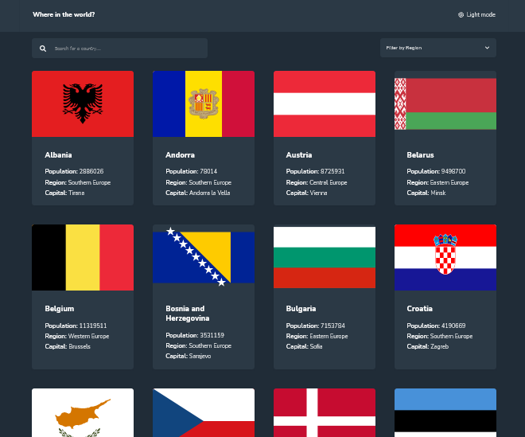
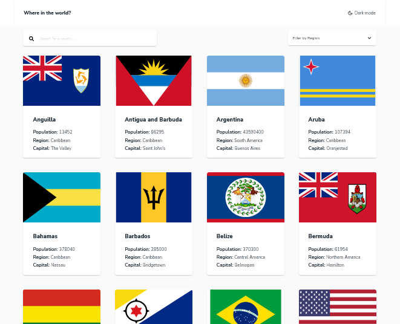
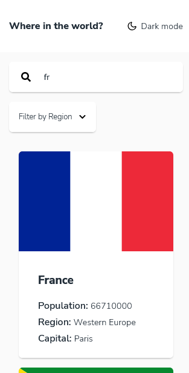
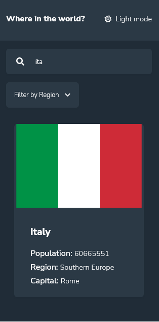

# Frontend Mentor - REST Countries API with color theme switcher

## Welcome! 👋

Thanks for checking out this front-end coding challenge.

[Frontend Mentor](https://www.frontendmentor.io) challenges help you improve your coding skills by building realistic projects.

### The challenge

Users should be able to:

- View the optimal layout for the section depending on their device's screen size

### Screenshot

#### Desktop

#### Mobile

### Links

- [Github repo](https://github.com/edgarfb/countries-rest-api)
- [Live Site URL](https://countries-rest-api-edgar-britez.vercel.app/)

## My process

### Built with

- React
- CSS Module
- Flexbox
- Mobile-first workflow
- Deploy on [vercel](https://vercel.com/)

### What I learned

I dived deeper on the React's wolrd working on this challenge, I use the fetch Api to get the data from the [Rest Country API](https://restcountries.com/#api-endpoints-v2), I used the React Router Dom and I worked with useParams hook.

### Continued development

Next I want to explore more about:

- Nextjs.
- Axios
- Formis

### Useful resources

- [React](https://reactjs.org/)
- [create-react-app](https://create-react-app.dev/)

## Author

- [Website](https://www.edgarbritez.com/)
- [Github](https://github.com/edgarfb)
- [Frontend Mentor](https://www.frontendmentor.io/profile/edgarfb)
- [Twitter](https://www.twitter.com/edgarfb_ok)

## Acknowledgments

I really enjoined and I learned a lot about layout whith the content of [Kevin Powell](https://www.kevinpowell.co/).\
You guys can enroll on [this course](https://courses.kevinpowell.co/conquering-responsive-layouts) totaly free.
